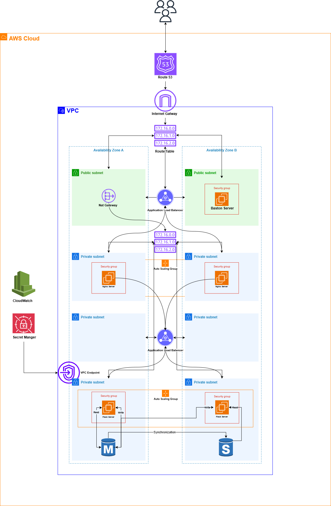
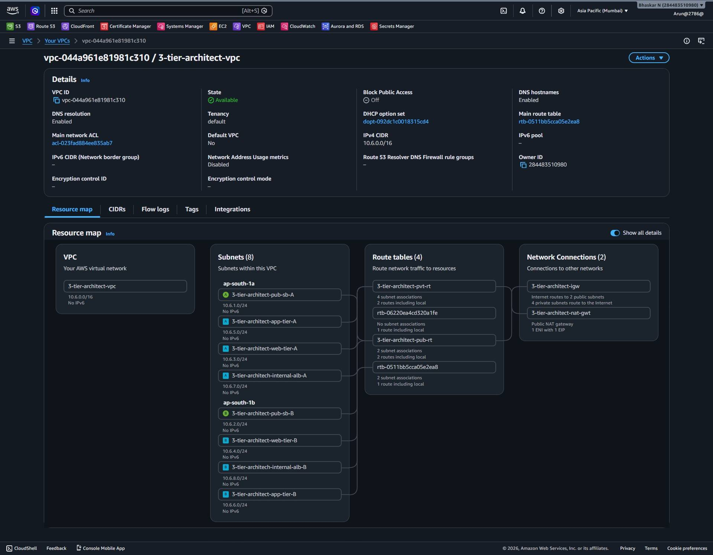
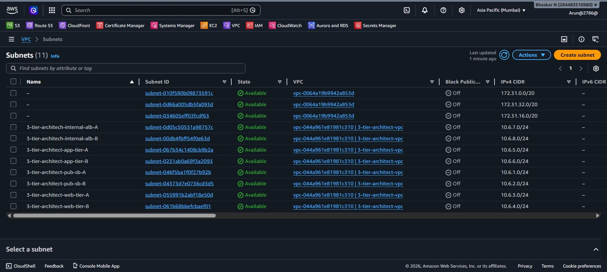
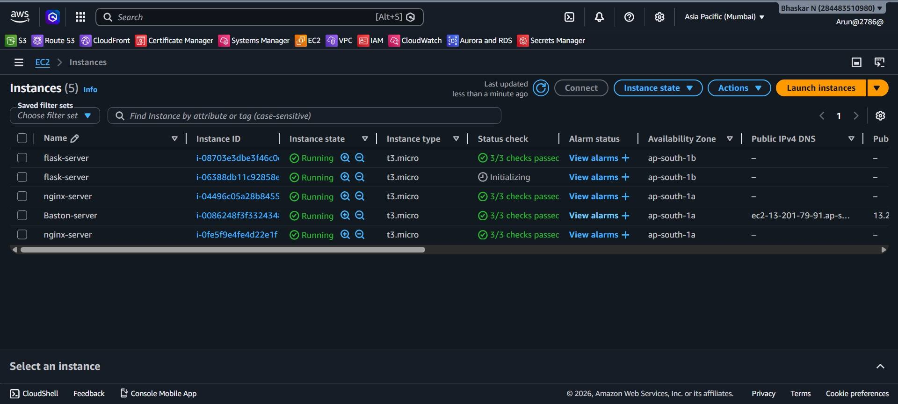
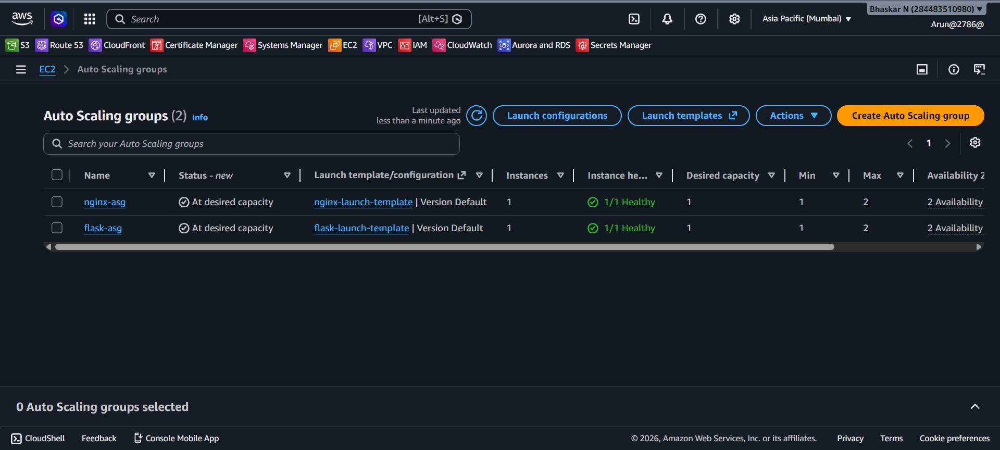
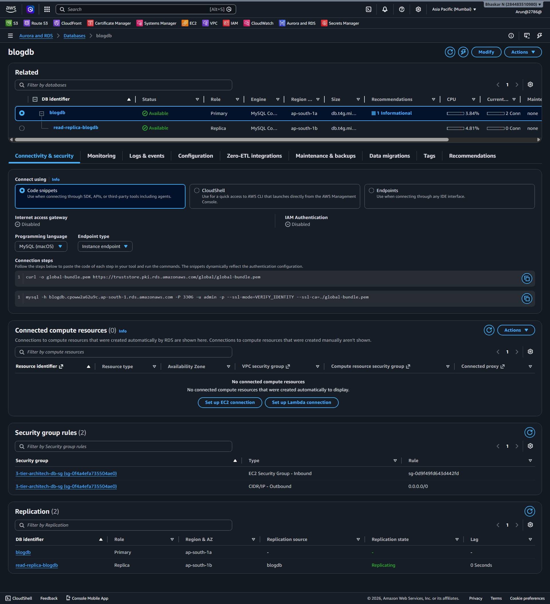
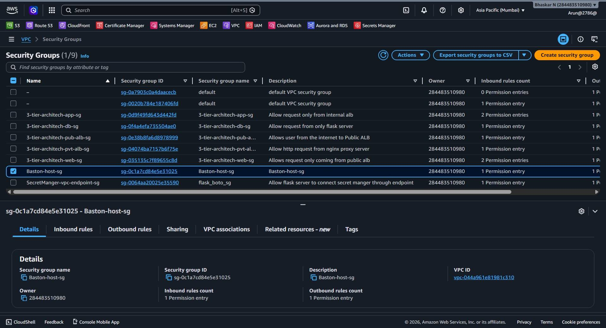
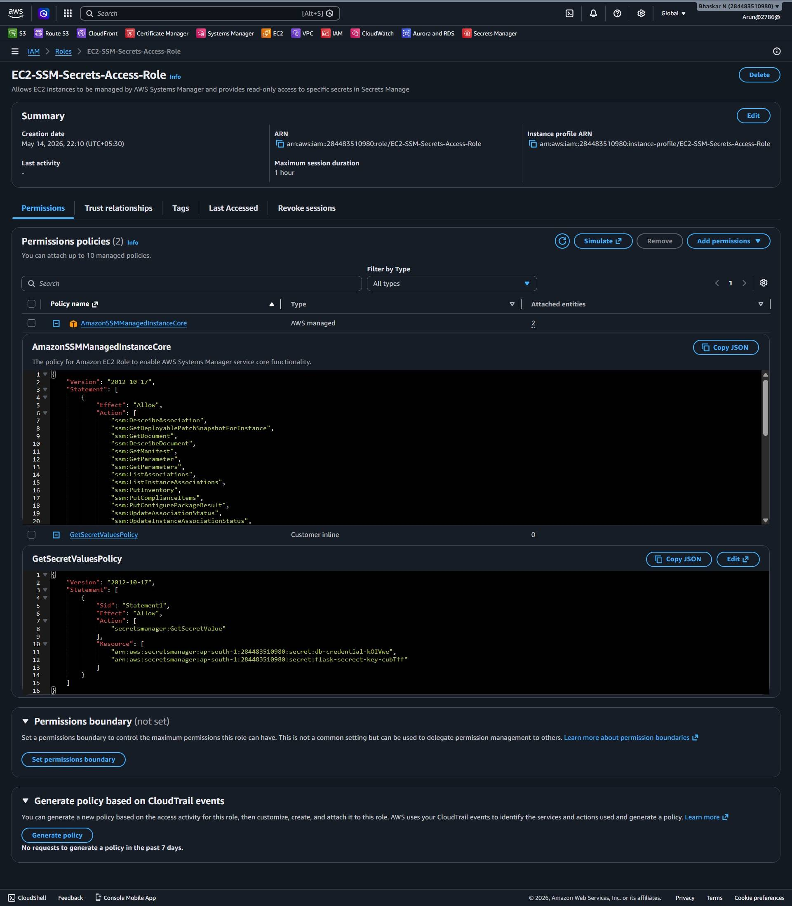
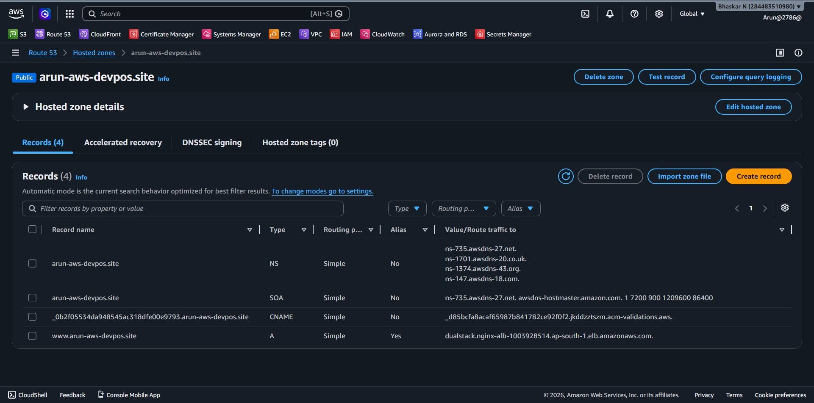

# 🚀 AWS Three-Tier Web Application Architecture

## 📌 Project Overview

This project demonstrates a **production-style Three-Tier Web Application Architecture** deployed on AWS using secure, scalable, and highly available cloud infrastructure.

The application is a Flask-based blog platform hosted behind multiple layers of networking, load balancing, reverse proxying, auto scaling, monitoring, and private cloud security.

The primary goal of this project was to gain hands-on experience with:

- AWS Networking
- Cloud Security
- High Availability Architecture
- Reverse Proxy Architecture
- Auto Scaling
- Monitoring & Scaling
- Secrets Management
- Real-World Deployment Troubleshooting

#

---

# 🏗️ Architecture Overview

The infrastructure follows a secure and scalable layered architecture model.



#

---

# ☁️ AWS Services Used

| Service               | Purpose                               |
| --------------------- | ------------------------------------- |
| VPC                   | Isolated cloud network                |
| EC2                   | Application hosting                   |
| ALB                   | Traffic distribution                  |
| Auto Scaling Group    | High availability and scaling         |
| RDS MySQL             | Managed relational database           |
| Route 53              | Domain and DNS management             |
| ACM                   | SSL/TLS certificate                   |
| CloudWatch            | Monitoring and alarms                 |
| IAM                   | Identity and access management        |
| Secrets Manager       | Secure credential management          |
| VPC Endpoint          | Private AWS service access            |
| Systems Manager (SSM) | Secure instance management            |
| NAT Gateway           | Internet access for private resources |
| Internet Gateway      | Public internet connectivity          |

---

# 🌐 Networking Architecture



## VPC Configuration

| Component  | Value                |
| ---------- | -------------------- |
| VPC Name   | 3-tier-architect-vpc |
| CIDR Block | 10.6.0.0/16          |
| Region     | ap-south-1           |

---

# 🧩 Subnet Design



## Public Subnets

| Subnet          | CIDR        |
| --------------- | ----------- |
| Public Subnet A | 10.6.1.0/24 |
| Public Subnet B | 10.6.2.0/24 |

Used for:

- Public ALB
- NAT Gateway
- Bastion Host

---

## Web Tier Subnets

| Subnet     | CIDR        |
| ---------- | ----------- |
| Web Tier A | 10.6.3.0/24 |
| Web Tier B | 10.6.4.0/24 |

Used for:

- Nginx Reverse Proxy Servers

---

## Application Tier Subnets

| Subnet     | CIDR        |
| ---------- | ----------- |
| App Tier A | 10.6.5.0/24 |
| App Tier B | 10.6.6.0/24 |

Used for:

- Flask Application Servers

---

## Internal ALB Subnets

| Subnet         | CIDR        |
| -------------- | ----------- |
| Internal ALB A | 10.6.7.0/24 |
| Internal ALB B | 10.6.8.0/24 |

Used for:

- Internal Load Balancer

---

# ⚙️ Compute Layer

## EC2 Instances

Configured Instances:

- nginx-server
- flask-server
- Bastion-server

###


# 🔁 Auto Scaling

Implemented Auto Scaling Groups for:

- nginx-asg
- flask-asg

## Features

✅ Dynamic Scaling\
✅ Health Checks\
✅ Multi-AZ Deployment\
✅ High Availability\
✅ Automatic Recovery

---

# ⚖️ Load Balancing

## Public ALB

Handles:

- Internet traffic
- HTTPS termination
- Traffic routing to Nginx tier

---

## Internal ALB

Handles:

- Internal traffic routing
- Communication between Nginx and Flask servers

---

# 🗄️ Database Layer

## Amazon RDS MySQL

Database Name:

```bash
blogdb
```

## Features

✅ Private Database Deployment\
✅ Read Replica Configuration\
✅ Replication Monitoring\
✅ Secure Security Group Rules\
✅ Multi-AZ Architecture Concepts

---

# 🔒 Security Architecture

## Security Groups

### Public ALB Security Group

Allows:

- HTTP (80)
- HTTPS (443)

### Web Tier Security Group

Allows:

- Traffic only from Public ALB

### App Tier Security Group

Allows:

- Traffic only from Internal ALB

### Database Security Group

Allows:

- MySQL access only from Flask servers

### Bastion Host Security Group

Allows:

- Secure SSH access

---

# 🔑 IAM & Secrets Management

## IAM Role

Created custom IAM role:

```bash
EC2-SSM-Secrets-Access-Role
```

## Permissions

- AWS Systems Manager access
- AWS Secrets Manager access
- Secure EC2 management

---

# 🧠 AWS Secrets Manager

Stored Secrets:

- db-credential
- flask-secret-key

## Benefits

✅ No hardcoded secrets\
✅ Secure credential management\
✅ Centralized secret storage\
✅ Improved application security

---

# 🔌 VPC Endpoint

Configured VPC Endpoint for:

```bash
AWS Secrets Manager
```

## Benefits

✅ Private AWS API communication\
✅ No public internet dependency\
✅ Enhanced security

---

# 🌍 Domain & SSL


## Route 53

Configured custom hosted zone:

```bash
arun-aws-devops.site
```

## ACM SSL Certificate

Configured:

✅ HTTPS\
✅ SSL/TLS Encryption\
✅ Secure Browser Connection

---

# 📈 Monitoring & Scaling


## CloudWatch Monitoring

Implemented:

- CloudWatch Metrics
- CloudWatch Alarms
- CPU Utilization Monitoring
- Auto Scaling Triggers

### Scaling Policy

```bash
CPUUtilization > 70%
```

## CPU Stress Testing

Performed:

- CPU utilization testing
- Scaling validation
- Alarm monitoring
- Health check validation

---

# 🛠️ Application Stack

| Technology          | Usage                |
| ------------------- | -------------------- |
| Python              | Backend language     |
| Flask               | Web framework        |
| Nginx               | Reverse proxy        |
| MySQL               | Database             |
| HTML/CSS/JavaScript | Frontend             |
| AWS                 | Cloud infrastructure |

#

---

# ⚠️ Challenges Faced During the Project

This project involved several real-world deployment and troubleshooting scenarios.

---

## 1. Python Dependency Errors

### Problems Faced

- Missing Python packages
- Version conflicts
- Flask dependency installation failures
- Virtual environment issues
- Pip compatibility problems

### Solutions

- Created Python virtual environments
- Used requirements.txt
- Fixed dependency conflicts
- Upgraded pip and setuptools

---

## 2. Nginx Reverse Proxy Errors

### Problems Faced

- 502 Bad Gateway
- Upstream connection failures
- Incorrect proxy\_pass configuration
- Internal ALB communication issues

---

## 3. ALB Health Check Failures

### Problems Faced

- Instances marked unhealthy
- Incorrect health check path
- Flask response issues
- Internal routing problems

---

## 8. Secrets Manager Integration Issues

### Problems Faced

- boto3 unable to retrieve secrets
- IAM permission denied
- VPC endpoint communication problems

##

---

# 📚 Key Learning Outcomes

This project helped in learning:

✅ AWS Networking\
✅ VPC Design\
✅ High Availability Architecture\
✅ Reverse Proxy Setup\
✅ Auto Scaling\
✅ Load Balancing\
✅ Cloud Security\
✅ Flask Deployment\
✅ RDS Management\
✅ IAM Security\
✅ Secrets Management\
✅ Cloud Monitoring\
✅ Infrastructure Troubleshooting\
✅ Real-World DevOps Practices

---

# 🔮 Future Improvements

Planned enhancements:

- Docker containerization
- Jenkins CI/CD pipeline
- Terraform Infrastructure as Code
- Kubernetes orchestration
- AWS WAF integration
- Centralized logging
- Monitoring dashboards

---

# 🎯 Project Goal

The main goal of this project was to build a production-style cloud infrastructure while gaining hands-on experience with real-world AWS deployment, networking, monitoring, scaling, and troubleshooting.

---

# 👨‍💻 Author

## Arun

AWS & DevOps Learner\
Focused on Cloud Infrastructure, DevOps, and Real-World AWS Architecture.

